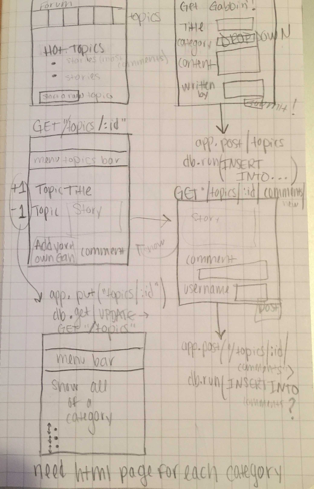
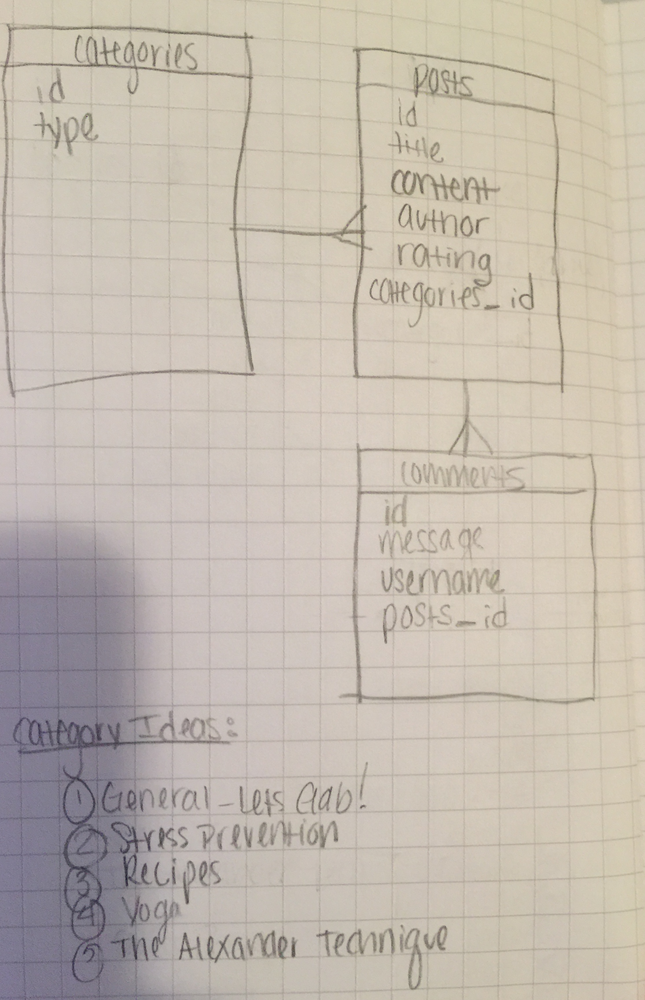

# WDI Project 2- Forum

## Objective
To make a basic full-stack forum application using JavaScript, Sqlite3, Express, HTML, and CSS.

## Minimum Viable Product
To create a forum application that allows users to create topic threads and comment on other user's posts.  

## Early Sketches

## Final Features
Using the Balance forum application a user will be able to:

- Read posts from other users listed by popularity.
- Read comments on a topic from other users.
- Comment on posts.
- Write their own posts for other users to read/comment on.
- Vote on posts.  
- Displays posts based on user popularity and rating.
- Responsive application able to easily view on phones or other mobile devices.
